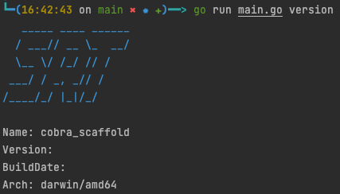

# SrfGernerator
## Introduce
Generate srt for a given document and interval

## Usage
```bash
go run main.go version
```


```bash 
go run main.go -f test/test.txt -t 2 -o test/test.srt 
cat test/test.srt 
```

## Cross Compile 
Install to local environment
```bash
sh .cross_compile.sh install
```
Delete the local installation
```bash
sh .cross_compile.sh uninstall
```
Compile for multiple schemas
```bash
sh .cross_compile.sh 
```

